# TP 11 : Authentification JDBC / JPA

## strecture de projet
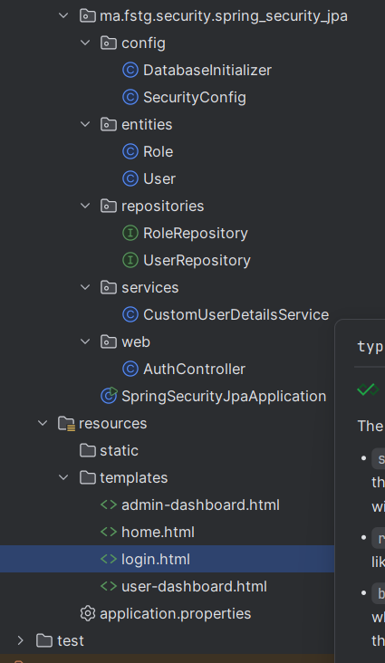

## Les tables dans la base de donnés
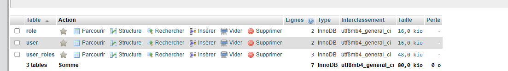

## Les mots de passes encodes
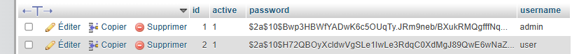

## Page login
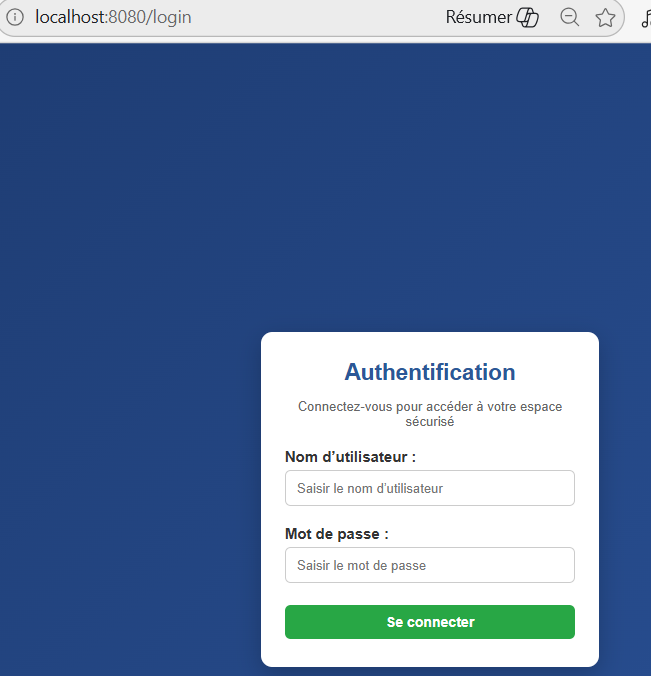
---
##  Connexion réussie  redirection vers home
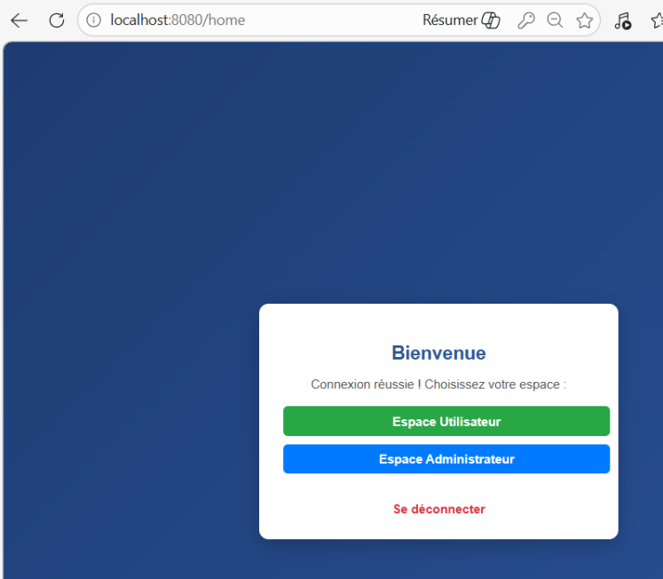
---
## Mauvise mot de passe
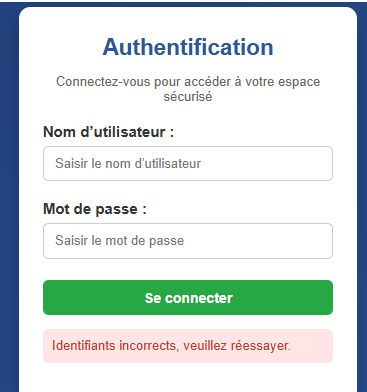
---
## Connection user vers /user/dashboard
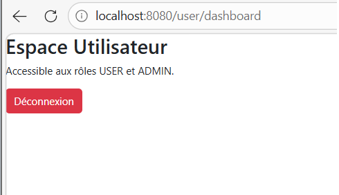
---
## Connection user à /admin/dashboard
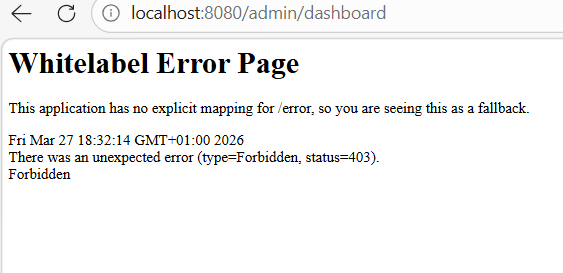
---
## Connection admin vers /admin/dashboard
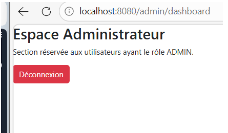
---
## Connction admin à /user/dashboard
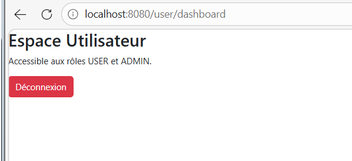
---
## Déconnexion
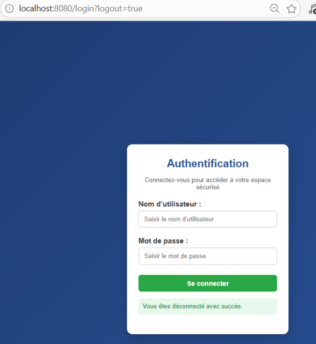